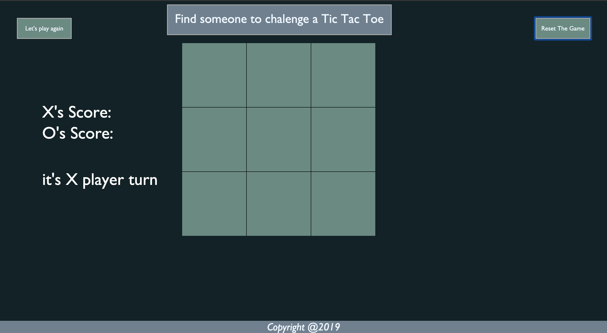

# Tic Tac Toe
This poject is for frontend of TicTacToe game.

## technologies used
the technologies that I used are:
* Texteditor: VS Code
* HTML, CSS and Vanilla JavaScript.

## Prerequisities 
You need to install any code editor and you must have a browser "I prefer to have 'Chrome' much better for developer"

## approach taken
//1. Create html file with table 3*3; and button to reset.
// 2. give each cell a same class and uniqe id; each cell give it a index;
// 3. by using js do the requirment below:
//      a. declare a player, counter and sampleOfWinning array.
//      b. start with a function inclode the defolt setting to help me in reset the game
//      c. let the player choose the index by clicking on the cell and replase the index nuber with the label of the user in arry.
//      d. make a tern switch between two player depend on the value of the player value number if 1 play X and change it to 0 , else play O and change it to 0.
//      e. and then check after the play if the array of the sampleOfWinning match any nested array of the "chance of winning in arrays" make it the winner;
//      f. and go to the function to remove all the listener on the cells.


## installation instructions.
Use git to install the project 
* Fork the file and copy the URL
in the Terminal go to the location that you want to locate the file
```
git clone THE LINK THAT YOU COPED
```

## unsolved problems
Improve the game to play with the machine.


## User stories.
* As a user, I should be able to start a new tic tac toe game.
* As a user, I should be able to click on a square to add X first and then O, and so on.
* As a user, I should be shown a message after each turn for if I win, lose, tie or who's turn it is next.
* As a user, I should not be able to click the same square twice.
* As a user, I should be shown a message when I win, lose or tie.
* As a user, I should not be able to continue playing once I win, lose, or tie.
* As a user, I should be able to play the game again without refreshing the page.

## Wireframe 


## The winner function 

    When the user click on the area of the cell I have in my system 8 situation of winning depend on the id of the cell, if the user have winning situation the system check as awlys the 8 situation of winning is the user match print the you the winner if nothing check the counter if it's = the number of cell "9" print Tie.

## Favorite functions

* Describe how some of your favorite functions work
    The "TicTacToe" function is reset the hole chanse of winning
    and reset the value of the counter to 0
    and turn on the event of the listener of all cells.

    ```
    const ticTocToe = function() {
        sampleOfWinning = [
            ['0', '1', '2'],
            ['3', '4', '5'],
            ['6', '7', '8'],
            ['0', '3', '6'],
            ['1', '4', '7'],
            ['2', '5', '8'],
            ['0', '4', '8'],
            ['2', '4', '6']
        ];
        counter = 0;
        player = 1;
        whosPlay.innerText = 'it\'s X player turn';

        for (let i = 0; i < cells.length; i++) {
            cells[i].addEventListener('click', clicCell);

        }
    }
    ```
